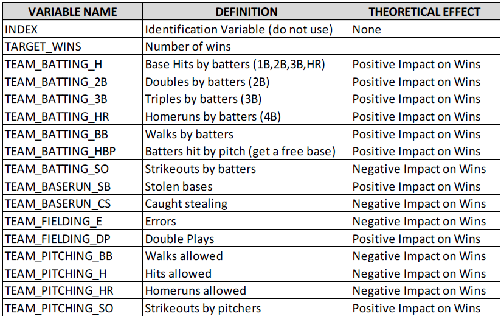
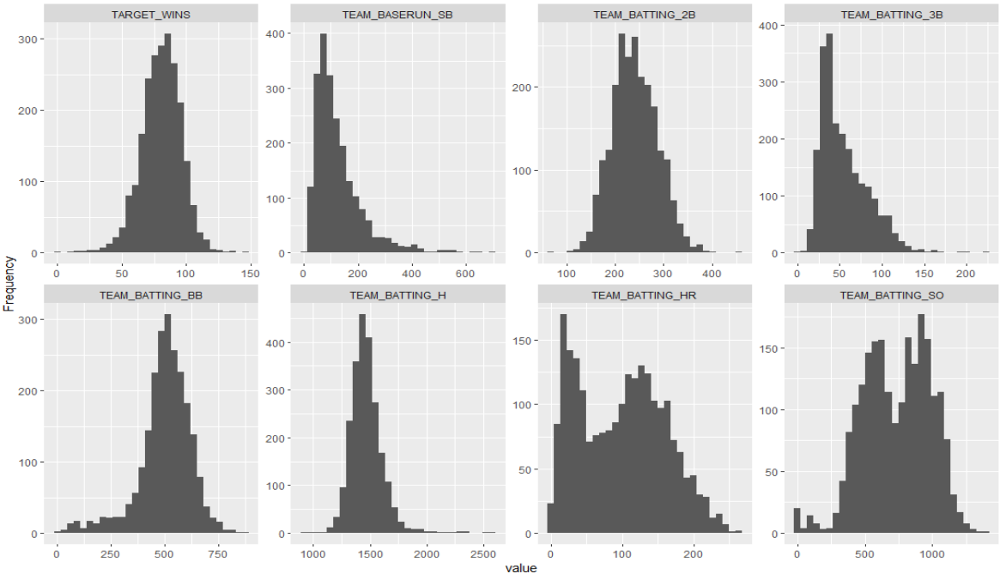
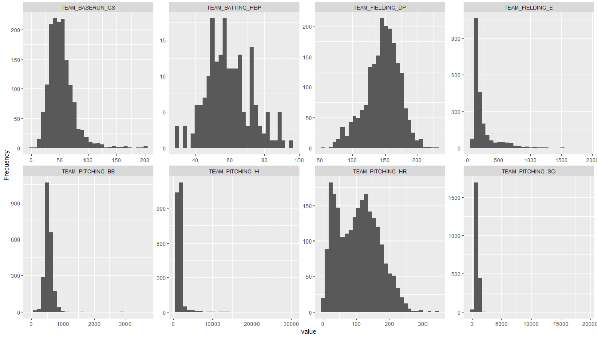
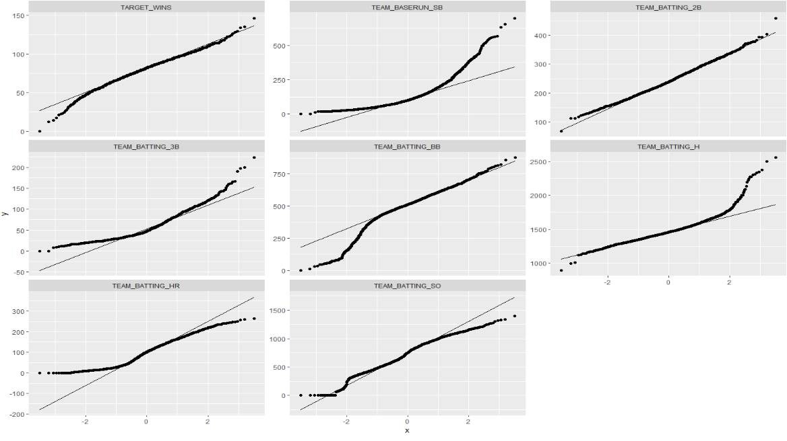
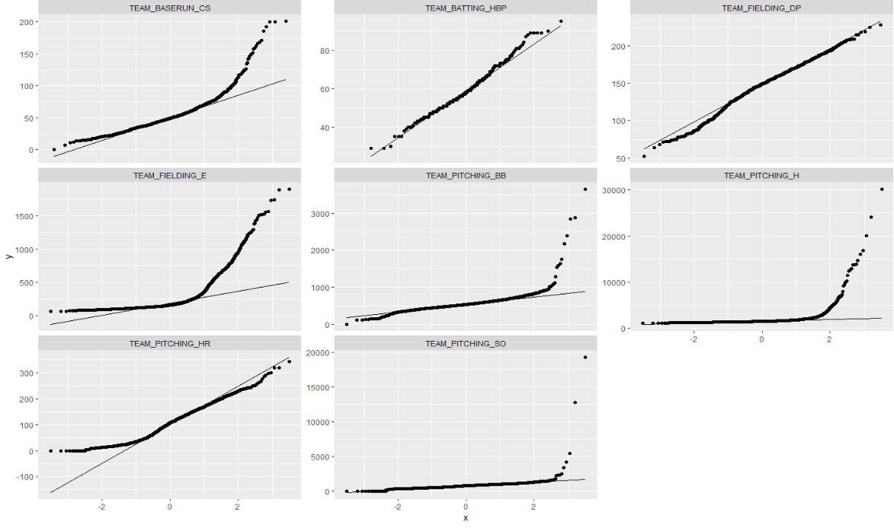
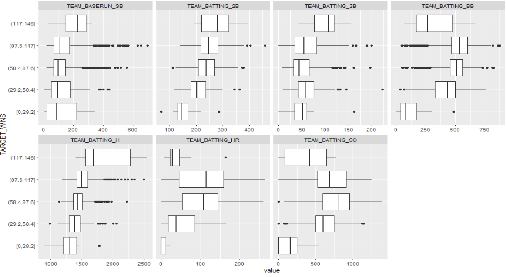
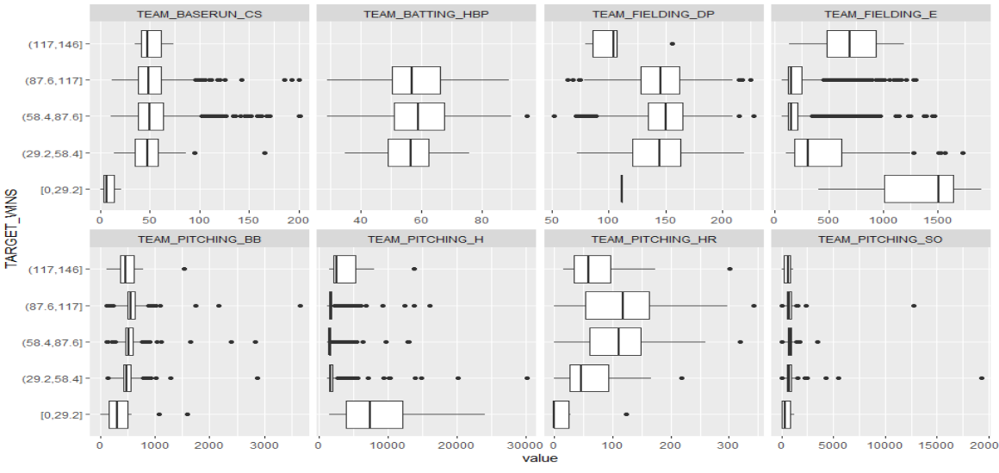

```{r setup,  include=FALSE}
knitr::opts_chunk$set(tidy.opts=list(width.cutoff=80),tidy=F,message=F,warning = F,echo = F)


```

 

```{r Libraries}

library(dplyr)
library(ggplot2)
library(tidyr)
library(data.table)
library(VIM)
library(mice)
library(Rcpp)
library(corrplot)
library(stats)
library(rstatix)
library(DataExplorer)
library(knitr)
library(cowplot)
library(kableExtra)
library(table1)
library(arsenal)

```


```{r Data Importation}

training <- read.csv("https://raw.githubusercontent.com/SieSiongWong/DATA-621/main/HW1/moneyball-training-data.csv", header=TRUE, sep=",")

training <- training %>% select(!INDEX)


evaluation <- read.csv("https://raw.githubusercontent.com/SieSiongWong/DATA-621/main/HW1/moneyball-evaluation-data.csv", header=TRUE, sep=",")


```


\pagebreak

 

# Introduction

|   For this assignment, we were tasked to explore, analyze and model a data set containing approximately 2200 records. Each record represents a professional baseball team from the years 1871 to 2006 inclusive. Each record has the performance of the team for the given year, with all of the statistics adjusted to match the performance of a 162 game season.

|   Our objective is to build a multiple linear regression model on the training data to predict the number of wins for the team. We can only use the variables given to us (or variables that we derive from the variables provided). Below is a short description of the variables of interest in the data set:

|   For all resources used in the making of this assignment, including the code used for all our findings, please use this link  \href{https://github.com/SieSiongWong/DATA-621/tree/main/HW1}{here} to find our GitHub page.
|

```{r,out.width="90%",fig.align="center"}


```


\newpage

# Data Exploration


## Initial Summary Statistics

|   As shown below, we can being exploring the initial state of our training data. We notice that we have a mix of normal and skewed variables. TEAM_PITCHING_H appears to be very right skewed.

|   We also notice that there are variables with lots of missing values, with the most extreme being TEAM_BATTING_HBP, which appear to be almost entirely missing. 

|   We also notice some odd values for TEAM_WINS. According to our research, the highest number of wins by a baseball team, is a tie at 116. However, there appears to be a team in our data that supposedly has 146 wins. There also appears to be a team that has 0 wins, which is also impossible. No such team has ever gone without winning a single game. There are hardly any teams with below 40 wins, and only one team that appears to have only won 20 games, but no teams below that. 

```{r,results='asis'}

first <- training %>% select( c(1:8))

sec <- training %>% select( !c(1:8))

my_controls <- tableby.control(
    total = FALSE,
  numeric.stats = c("meansd", "medianq1q3", "range","Nmiss"), 

  digits=2
)


t1 <- kable(summary(tableby(~.,first,control = my_controls),text=T),format="latex",booktabs = TRUE)
t2 <- kable(summary(tableby(~.,sec ,control = my_controls),text=T), format="latex",booktabs = TRUE) 

cat(c("\\begin{table}[!htb]
    \\hspace*{-1cm}
    \\vspace*{-1cm}
    \\begin{minipage}{.5\\linewidth}
      \\vspace*{-1cm}",
        t1,
    "\\end{minipage}%
    \\begin{minipage}{.5\\linewidth}
      \\hspace*{1cm}",
        t2,
    "\\end{minipage} 
\\end{table}"
))  

```

|


\pagebreak


## Distributions

|   The graphics below allow us to explore the distribution of our values in our training data. We can now more clearly explore the distributions of our variables and notice any skewing in our data more clearly. 


```{r,out.width="105%",fig.align="center"}


```


```{r,out.width="105%",fig.align="center"}



```

\newpage

## Boxplots
|   As shown below, we can begin exploring the trends in our data when split up into different win groupings. We first notice that the two groups with wins above and below what should be possible both have weird distributions relative to the other groups.

|   We also make note here, that the our main variables of interest, the variables showing number of bases scored by batters,  appear to be relatively normal in distribution when they are split up by group like this.  


```{r,out.width="100%",fig.align="center"}


```


\newpage

## Missing Values

|   We can see in the figure below that quite a few of the variables in both the training and evaluation set have missing values. The two primary methods to handle these missing values are imputation or data removal.  There are couple options to deal with these missing values.

- remove rows containing missing values
- replace missing values with an average value
- replace missing value with a median value

|   From our missing values chart, we can see that there are 91% missing values in TEAM_BATTING_HBP variable, 34% missing values in TEAM_BASERUN_CS and so on.

|   The data also showed a few variables with the value of “zero”, which made us question their validity, but after further investigation we concluded that these values are legitimate. For instance, we have 20 zero values for batting and pitching strikeouts. It is reasonable to assume that a team had zero pitching strikeouts or that a team had zero batting strikeouts during a season, and in a span of 136 years it is not surprising to see a few teams with zero strikeouts. 

|   What is interesting though is that we see a correlation between the number of zero strikeouts from both the batting and pitching performance. We can also observe the same for the variables right below in batting and pitching home runs, as well as walks by batters and walks allowed. This could just be a coincidence but there is no way of telling with the data provided to us as we can’t see which statistics belong to what team. However, knowing or not knowing this information should not affect our analyses or the performance of our models, thus we decided to keep these values for the analyses.


```{r,out.width="105%",fig.align="center"}
plot_missing(training,title="Missing Values in our Training Data")


```


\newpage


# Data Preparation

|   After the data exploration phase was completed, we transitioned into preparing the data for our regression models. 

|   Given the number of data abnormalities, we needed to incorporate some data transformations prior to imputation. First we dropped the INDEX and TEAM_BATTING_HBP variables as they did not serve as useful inputs for our models. The rationale is that the INDEX variable provided no valuable information, and the TEAM_BATTING_HBP was missing nearly all of its data points.

|   We also dropped variables that exhibited large amounts of skew and nonlinearity. We determined that they had lower correlation with the dependent variable and would also cause the models to inaccurately predict TARGET_WIN values. Skew and nonlinear data points can cause a large amount of variability in a regression model. Thus, we decided that if they had no application to the models ability to interpret the dataset it was better to remove them from the process.

|   After applying these transformations, we strategized on how to handle the missing data points. We assumed that the missing data was missing at random and chose to impute the data points using the predictive mean matching (PMM) algorithm in the MICE library. The reason that we chose this method rather than replacing it with the mean or median is because of the large number of missing values. The PMM methodology allowed us to maintain the underlying structure of the existing data variation while reducing the possibility for implausible values being calculated. It is our view that this method reduced the risk of further skewing the values of our variables while respecting the heteroscedastic nature of the dataset. 


# Model Building

|   Following the data preparation phase, we brainstormed how best to construct an appropriate model design process. Our initial step was to partition the transformed dataset with the imputed data points from our PMM methodology. This was done in order to use 70% of it in the models and then evaluate their performance with the predictions against the remaining 30%. 

|   Following the partition, we constructed a saturated regression model which contained all variables of the transformed dataset. This gave us a starting point to analyze the statistical significance of each variable and their associated correlations to the dependent variable. 

|   Using the backward elimination methodology we were able to discern variables that did not contribute to our regression model. Producing a statistical summary of our saturated model we can see that four variables had p-values that were statistically insignificant. The variables are as follows:

- TEAM_BATTING_2B 
- TEAM_BASERUN_CS
- TEAM_PITCHING_HR
- TEAM_PITCHING_BB 

|   To confirm these p-values, we conducted a hypothesis test to determine whether the null hypothesis of each coefficient was equal to zero. The result of the test indicated that the p-value of the F-test was 0.1262. This allowed us to conclude that the null hypothesis cannot be rejected. 

|   We also conducted a permutation test which resulted in similar findings to our statistical summary. The permutation test results were similar to the normal theory-based value of 2.22e-16. This conclusion allowed us to confirm that the 4 predictors, which we deemed statistically insignificant, had weak relationships to the response variable. Based on these findings we removed these four variables and created our first linear regression model.

|   For our second model we referred to the summary result from model 1. We saw that TEAM_BATTING_BB was the least strongest relationship with the response variable as compared to the rest of predictors. We drop this predictor to build our second model. 

|   In order to construct our final model we analyzed the correlations associated with our saturated model, first model, and second model. Based on the analysis we were able to remove the variables TEAM_BASERUN_SB, TEAM_PITCHING_SO, and TEAM_BATTING_3B  as their correlation to TARGET_WINS was nearly 0 when running the correlations on model 1. This allowed us to infer that the impact from these variables were negligible. From a real world perspective this makes sense as stolen bases and triples are rarer events, as teams who can consistently put players on the bases through singles and doubles seemingly have greater wins. However, we could not conclude model superi


# Selecting Models

|   To evaluate our models we constructed a residuals plot, QQ plot, and also applied the Shapiro-Wilk normality test. This allowed us to check whether the residuals were normal. Models one and two met the required conditions of linearity, nearly normal residuals, and constant variability of the least squares regression. The Shapiro-Wilk normality test also proved the normality of the data in those two models with a p-value greater than 0.05.

|   The slight variations in models 1 and 2 was the kurtosis and skew in the tails. However they did not appear to be extreme deviations from the mean prompting us to further explore other performance metrics. Model three appeared to have the least normal residuals.

|   Our second test of our models' performances was the RMSE test. The corresponding visualizations of the RMSE test indicated that the model 1 had the lowest RMSE. However, the variation in the models was minimal indicating that model 1 only had slightly fewer errors than the other two models. This required a test of other key metrics to confirm.

|   Our final test analyzed the min-max accuracy, mean absolute percentage error, mean standard error, and mean absolute error. Now these tests produced consistent results with Model 1 having the greatest performance accuracy and the best scores on the rest of the metrics. However, the differences in each test were marginal. Thus, the question arose, how do you select the best model of the three? Given the higher accuracy in model one, the normality of the residuals, and the inclusion of additional variables we felt that model one would best handle variability in new datasets. The marginal differences in the rest of the performance metrics indicated that model one was nearly in line with the rest of the models and despite a higher level of kurtosis in the tails the residuals were nearly normal. In addition, we felt that the additional variables would capture the volatile nature of baseball and be most applicable to real world dynamics.

|   Selecting model 1 as the primary model, we constructed a prediction set from the evaluation dataset and saved this to a CSV file. The corresponding results will be provided with this report on our GitHub page for this assignment.


# Conclusion
 
|   This assignment had us work with an interesting set of data, with many odd values. From the impossible number of wins and vast number of missing values in our data, this assignment was both a challenge and an excellent learning experience. Every member in our group had to also overcome the fact that none of us knew much of anything when it comes to baseball.

|   Given our current limited knowledge on feature selection  and model building, we feel that our approach was done very well. However, we could have possibly explored the relationships between our variables more and used that to create new combinations of our values  to better understand the overall shape of the data. If we had more time, we would love to explore any kind of new method that would improve our model. 

|   Overall, we are happy with our final results and look forward to seeing how well our model performs. There is still much to learn and improve on, but this concludes the work we did for this  assignment. 
